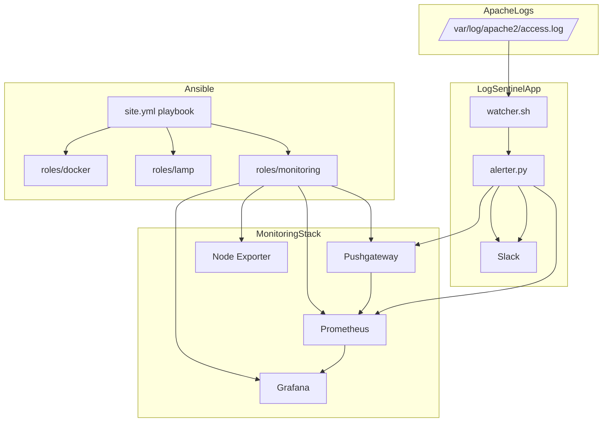

# LogSentinel Architecture

## System overview

LogSentinel is a layered AIOps platform with the following components:

- **Ansible**: deployment automation and configuration management.
- **Docker**: runtime environment for monitoring services.
- **Apache / MySQL / PHP**: LAMP stack application target.
- **Prometheus**: metrics collection and scraping.
- **Grafana**: visualization and dashboarding.
- **Pushgateway**: receives pushed anomaly metrics.
- **Python detector**: parses logs and identifies anomalies.
- **Slack**: alert delivery channel.

## Deployment topology

## Data flow

1. Ansible deploys the infrastructure on a target host.
2. Prometheus scrapes its own metrics, Node Exporter, and Pushgateway.
3. The Bash watcher tails Apache access logs.
4. The Python detector parses log lines and aggregates activity per IP.
5. The alerter pushes anomaly metrics to Pushgateway.
6. Grafana visualizes metrics from Prometheus.
7. Slack receives notifications when anomalies are detected.

## Component responsibilities

### `ansible/`
- Manages inventories for `dev`, `staging`, and `prod`.
- Uses a vault file for secret management.
- Deploys Docker, LAMP, and monitoring containers.

### `monitoring/`
- `prometheus.yml`: configuration for scrape targets.
- Grafana provisioning files: auto-load datasources and dashboards.

### `logsentinel/parser.py`
- Converts Apache access log text into Python dictionaries.
- Supports response times and request parsing.

### `logsentinel/detector.py`
- Aggregates log records by remote host.
- Extracts features for anomaly detection.
- Uses `IsolationForest` to score anomalous IP addresses.

### `logsentinel/alerter.py`
- Sends Prometheus metrics via Pushgateway.
- Sends Slack alert messages when anomalies exist.
- Writes analysis results to JSON.

### `logsentinel/watcher.sh`
- Implements a lightweight streaming log watcher.
- Triggers anomaly detection after a threshold of new lines.
- Supports log rotation and temporary batching.

## Learning insights

### Why separate inventories?
Multi-environment inventories let you deploy the same automation to different targets without changing the playbook.

### Why use Docker for monitoring services?
Docker ensures the Prometheus/Grafana stack is isolated and portable, making the monitoring layer easy to deploy and manage.

### Why use Prometheus Pushgateway?
Pushgateway allows short-lived jobs or scripts to send metrics to Prometheus, which is ideal for log-based anomaly detection that is triggered intermittently.

### Why use an isolation forest?
Isolation Forest is effective for anomaly detection in unlabeled data because it isolates outliers based on the number of splits required to separate a point.

### Why Slack alerts?
Slack provides a fast feedback loop for operators and creates an audit trail for anomaly notifications.
